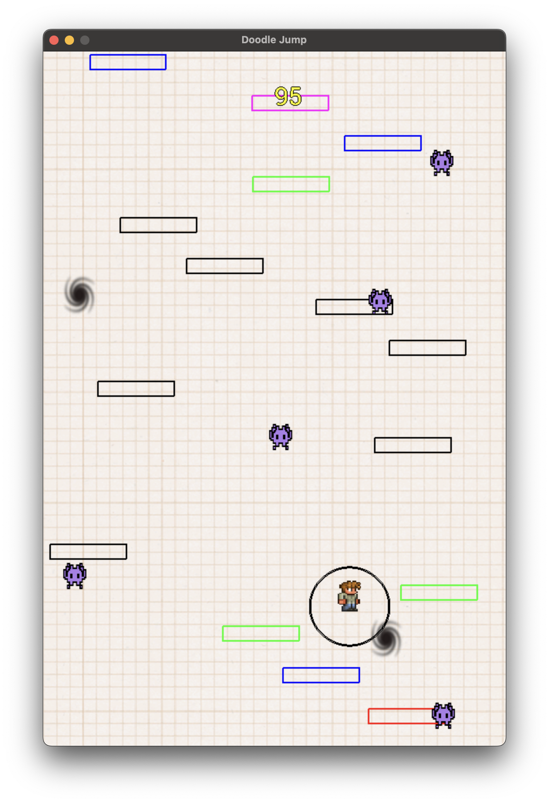
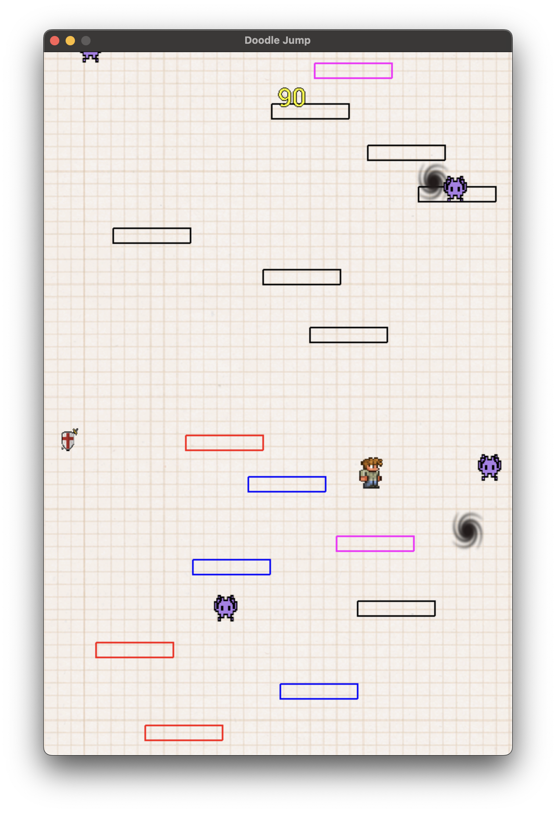

# Doodle Jump Like

A C++ game inspired by **Doodle Jump** built with SDL2. Control a character that bounces upward through an endless world filled with platforms, monsters, and power-ups!

## Game Preview

<div align="center">
  
  
</div>

## Game Objective

Control your character as it climbs through an endless vertical world. Avoid monsters, collect shields, and aim for the highest score possible by bouncing on platforms and defeating enemies.

## Controls

| Action | Input |
|--------|-------|
| **Start Game** | Press `S` or **Right-click** from the main menu |
| **Move Left/Right** | **Arrow keys** (← →) |
| **Shoot** | **Left-click** (short or long press) |

### Configuration
You can adjust these constants for different gameplay experiences:
- **`dt`** - Controls player rebound speed
- **`vitesseJeu`** - Global speed multiplier for all objects

*Default values are already well-balanced for optimal gameplay.*

## Game Rules

### Game Over Conditions
- Touch the bottom of the screen
- Collide with a monster (unless protected by shield)

### Scoring System
| Action | Points |
|--------|--------|
| Land on standard platform | **+5** |
| Break a "broken" platform | **+10** |
| Kill a monster | **+20** |

### Power-ups
- **Shields**: Provide temporary invulnerability against monsters

## Technical Overview

### Core Mechanics
- **Physics-based player**: Single particle with realistic forces and sprite rendering
- **Endless world**: Platforms recycle from bottom to top seamlessly
- **Smart collision**: Player bounces only when landing from above
- **Dynamic difficulty**: Speed increases based on player height

### Platform Types
- **🟢 Classic**: Standard bouncing platforms
- **🔴 Broken**: Falls when player lands (higher points)
- **🔵 Moving**: Slides horizontally left-right
- **🟡 Jump**: Provides extra-high bounce
- *Note: Platforms can combine properties (e.g., moving + broken)*

### Special Elements
- ** Black Holes**: Apply gravitational pull within their radius
- ** Projectiles**: Rotating triangles with color interpolation and timed lifecycle
- ** Shield Drops**: Collectible protection that creates a defensive ring around player

### Performance Features
- **Adaptive Speed System**:
  - Height 1/3 - 3/4 of screen: **1.5x speed**
  - Above 3/4: **1.7x speed**  
  - Below 1/3: **Default speed**
- **Optimized Rendering**: Efficient sprite management and smooth animations

##  Building & Running

Make sure you have SDL2 installed, then:

```bash
make
./doodle_jump
```

## 📁 Project Structure

```
doodleJump_like/
├── data/           # Game assets (sprites, fonts, sounds)
├── engine/         # SDL wrapper and core engine
├── game/           # Game logic, rendering, and types
├── public/         # Screenshots and preview images
└── main_DOODLE.cpp # Entry point
```
